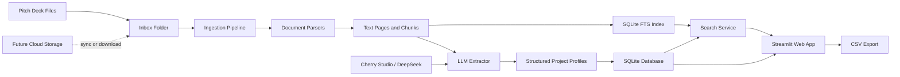

# BP Screener

BP Screener is a lightweight deal-flow screening tool for student teams, angel communities, and small research groups that need to review large batches of pitch decks without building a full investment platform.

## About

The project turns raw business plans and pitch decks into a searchable, filterable project database. Users can upload or sync files into a local inbox, run a batch ingestion pipeline, and get structured profiles for each startup: industry, AI relevance, financing stage, business model, team highlights, traction, risks, recommendation level, tags, and evidence snippets.

It is intentionally low-cost and storage-agnostic. The current version uses local files, SQLite, SQLite FTS, Streamlit, and an OpenAI-compatible LLM endpoint such as Cherry Studio with DeepSeek. Cloud storage can be added later by syncing files into the inbox directory or pointing the ingestion pipeline at a mounted cloud-drive folder.

## Features

- Batch ingestion for `PDF / PPTX / DOCX / TXT / MD`
- LLM-powered structured extraction through Cherry Studio, DeepSeek, or any OpenAI-compatible endpoint
- Local SQLite project database
- SQLite FTS keyword search over extracted document chunks
- Streamlit web app for upload, ingestion, search, filtering, detail view, and CSV export
- Evidence-first project profiles with source snippets when the model provides them
- Storage-agnostic design for Feishu Drive, OneDrive, OSS, COS, or local folders

## Technical Architecture



## Repository Layout

```text
bp-screener/
  app.py                    # Streamlit web app
  bp_screener/
    config.py               # Runtime configuration
    db.py                   # SQLite schema and persistence helpers
    extractor.py            # LLM extraction and fallback heuristics
    ingest.py               # Batch ingestion CLI
    parsers.py              # PDF, PPTX, DOCX, TXT, and MD parsing
    search.py               # Keyword search and structured filters
  data/
    inbox/                  # Local file inbox; replaceable with a synced cloud folder
```

## Setup

```powershell
cd path\to\bp-screener
python -m venv .venv
.\.venv\Scripts\Activate.ps1
pip install -r requirements.txt
copy .env.example .env
```

## Configure Cherry Studio / DeepSeek

Edit `.env`:

```env
LLM_BASE_URL=http://localhost:23333/v1
LLM_API_KEY=not-needed-for-local
LLM_MODEL=deepseek-chat
```

If Cherry Studio exposes a different OpenAI-compatible base URL, replace `LLM_BASE_URL` with the actual endpoint.

If no model endpoint is available yet, uncheck "Use DeepSeek / Cherry Studio extraction" in the web app. The system will use a basic keyword-based fallback, which is useful for testing the workflow but not recommended for real screening.

## Run The Web App

```powershell
streamlit run app.py
```

Then:

1. Upload pitch decks from the sidebar, or copy files into `data/inbox/`.
2. Click "Start / continue processing inbox".
3. Use "Project Library" for structured filters.
4. Use "Search" for keyword search.
5. Use "Project Detail" to inspect one structured profile.

## Batch Ingestion

```powershell
python -m bp_screener.ingest data\inbox --limit 100
```

Parse files without calling the model:

```powershell
python -m bp_screener.ingest data\inbox --limit 10 --no-llm
```

## Storage Integration

The current entry point is `data/inbox/`. To add storage later, sync or download files into that directory, or change `BP_INBOX_DIR` in `.env`.

Recommended options:

- Feishu Drive: sync or download files into a local folder before ingestion.
- OneDrive: point `BP_INBOX_DIR` to the synced folder.
- OSS/COS: add a small downloader before `ingest.py`, or extend the ingestion layer to read object listings directly.

## Current Limitations

- OCR is not wired in yet, so scanned PDFs may produce little or no text.
- Search is currently keyword-based with SQLite FTS; vector search can be added later.
- LLM quality depends on the model configured in Cherry Studio and its context length.
- For 10,000 decks, use CLI batch ingestion instead of processing everything through the web UI at once.

## Roadmap

- Add OCR for scanned PDFs
- Add vector search and semantic retrieval
- Add project comparison views
- Add source-page preview links
- Add Feishu Drive, OneDrive, OSS, or COS connectors

