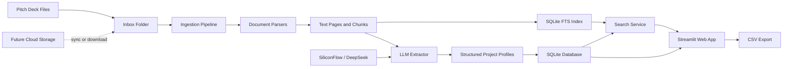

# BP Screener Workbench

**English** | [中文](README.zh-CN.md)

BP Screener Workbench is a lightweight shared workspace for a four-person student team reviewing large batches of business plans and pitch decks.

## About

The project turns raw business plans and pitch decks into a searchable, filterable project library. A small team can upload files, run automatic analysis, and get structured profiles for each startup: industry, AI relevance, financing stage, business model, team highlights, traction, risks, recommendation level, tags, and evidence snippets.

It is intentionally small, low-cost, and easy for four collaborators to use. The current version uses local files, SQLite, SQLite FTS, Streamlit, and SiliconFlow's OpenAI-compatible DeepSeek endpoint. Cloud storage can be added later by syncing files into the inbox directory or pointing the ingestion pipeline at a mounted cloud-drive folder.

## Features

- Batch ingestion for `PDF / PPTX / DOCX / TXT / MD`
- Fast PyMuPDF-based PDF text extraction with `pypdf` fallback available
- Optional local OCR fallback for scanned PDFs
- LLM-powered structured extraction through SiliconFlow, DeepSeek, or any OpenAI-compatible endpoint
- Local SQLite project database
- SQLite FTS keyword search over extracted document chunks
- Streamlit workbench for upload, automatic analysis, search, filtering, detail view, project discussion, and export
- Evidence-first project profiles with source snippets when the model provides them
- Storage-agnostic design for Feishu Drive, OneDrive, OSS, COS, or local folders

## Technical Architecture



## Repository Layout

```text
bp-screener/
  app.py                    # Streamlit web app
  bp_screener/
    config.py               # Runtime configuration
    db.py                   # SQLite schema and persistence helpers
    extractor.py            # LLM extraction and fallback heuristics
    ingest.py               # Batch ingestion CLI
    parsers.py              # PDF, PPTX, DOCX, TXT, and MD parsing
    search.py               # Keyword search and structured filters
  data/
    inbox/                  # Local file inbox; replaceable with a synced cloud folder
```

## Setup

```powershell
cd path\to\bp-screener
python -m venv .venv
.\.venv\Scripts\Activate.ps1
pip install -r requirements.txt
copy .env.example .env
```

## Configure ModelBest / DeepSeek

Edit `.env`:

```env
LLM_BASE_URL=https://llm-center.modelbest.cn/llm/v1
LLM_API_KEY=replace-with-your-local-api-key
LLM_MODEL=deepseek-v3.2
LLM_PROVIDER_ID=
LLM_ENABLE_THINKING=false
LLM_MAX_TOKENS=4096
LLM_TIMEOUT_SECONDS=120
```

The system calls ModelBest through its OpenAI-compatible chat completion API. `LLM_PROVIDER_ID` is optional and can be set to a specific channel ID if needed.

Keep the real API key in `.env` only. `.env` is ignored by Git and should not be committed.

If no model endpoint is available yet, uncheck "Use DeepSeek V3.2 extraction" in the web app. The system will use a basic keyword-based fallback, which is useful for testing the workflow but not recommended for real screening.

## Optional Local OCR

Scanned or image-only PDFs may not contain selectable text. BP Screener can run local OCR before LLM extraction so those decks still enter search, RAG, and structured screening.

Install Python dependencies:

```powershell
pip install -r requirements.txt
```

Install the Tesseract OCR desktop engine separately, then point `.env` to it if it is not on `PATH`:

```env
PDF_TEXT_ENGINE=pymupdf
OCR_ENABLED=true
OCR_LANG=eng+chi_sim
OCR_MIN_PAGE_CHARS=80
OCR_MIN_DOCUMENT_CHARS=800
OCR_MAX_PAGES=25
OCR_DPI=180
TESSERACT_CMD=C:\Program Files\Tesseract-OCR\tesseract.exe
OCR_TESSDATA_DIR=data/tessdata
```

`PDF_TEXT_ENGINE=pymupdf` uses the fast local PyMuPDF parser first, with `pypdf` available as a fallback by setting `PDF_TEXT_ENGINE=auto`. OCR is only used when the whole PDF has very little extracted text, which avoids OCR on normal slide decks that already contain selectable text. `OCR_MAX_PAGES` keeps batch processing fast by limiting how many pages per deck use OCR.

## Run The Web App

```powershell
streamlit run app.py
```

Then:

1. Upload pitch decks from the sidebar, or copy files into `data/inbox/`.
2. Click "Start / continue processing inbox".
3. Use "Project Library" for structured filters.
4. Use "Search" for keyword search.
5. Use "Project Detail" to inspect one structured profile.

## Batch Ingestion

```powershell
python -m bp_screener.ingest data\inbox --limit 100
```

Parse files without calling the model:

```powershell
python -m bp_screener.ingest data\inbox --limit 10 --no-llm
```

## RAG / Semantic Search

The system now includes a lightweight RAG retrieval layer:

- `chunks_fts`: SQLite FTS keyword search
- `chunk_embeddings`: local feature-hashing semantic vectors
- `Hybrid Search`: keyword + semantic retrieval
- `Ask All BPs` cache: repeated questions reuse the local SQLite answer cache when the BP library has not changed

The retrieval path follows a lightweight version of ideas from RAGFlow, LlamaIndex, Milvus, mem0, LightRAG, and llmware: use cheap local signals first, then spend compute only on a smaller candidate set. For this student-team version, BP Screener keeps SQLite instead of adding a vector database by default:

- BM25 / FTS gets a candidate set quickly.
- Structured project profiles add high-signal BP metadata.
- Local vectors rerank only the candidate set when possible.
- If there are no candidates, semantic search scans only up to `RAG_SEMANTIC_MAX_ROWS`.
- Repeated library questions are cached until the BP library changes.

Tune speed settings in `.env`:

```env
RAG_KEYWORD_PREFILTER_LIMIT=80
RAG_SEMANTIC_MAX_ROWS=20000
RAG_QA_CACHE_ENABLED=true
```

Newly ingested BPs automatically create chunk vectors. Backfill existing data with:

```powershell
python scripts\build_semantic_index.py
```

Force a rebuild:

```powershell
python scripts\build_semantic_index.py --force
```

This follows the Open Notebook / NotebookLM idea while keeping BP Screener's vertical workflow: structured project profiles, investment screening fields, AI committee reviews, four-person collaboration, and Notion sync.

## Acknowledgements

BP Screener is a focused student-team BP screening workbench. It is not a fork of the projects below, but it takes inspiration from their product and architecture ideas:

- [AnythingLLM](https://github.com/mintplex-labs/anything-llm): local-first RAG workspaces, document pipelines, model/provider flexibility, and agent workflows.
- [Open Notebook](https://github.com/lfnovo/open-notebook): NotebookLM-style source organization, grounded chat, citations, and multi-source knowledge workflows.
- [Atlas](https://atlas.org): student-friendly task entry points and low-friction AI study workspace design.

## Storage Integration

The current entry point is `data/inbox/`. To add storage later, sync or download files into that directory, or change `BP_INBOX_DIR` in `.env`.

Recommended options:

- Feishu Drive: sync or download files into a local folder before ingestion.
- OneDrive: point `BP_INBOX_DIR` to the synced folder.
- OSS/COS: add a small downloader before `ingest.py`, or extend the ingestion layer to read object listings directly.

## Notion Collaboration Workspace

Notion is a good collaboration front end for the four-person review team: project database, filtered views, manual reviews, AI committee decisions, and activity history. PDF parsing, LLM extraction, and full-text search still run in BP Screener, then structured results are synced to Notion.

Create a blank parent page in Notion and share it with your Notion internal integration. Then configure `.env`:

```env
NOTION_API_KEY=secret_xxx
NOTION_PARENT_PAGE_ID=your-parent-page-id
```

Create the Notion databases:

```powershell
python scripts\notion_sync.py setup
```

Sync local BP data:

```powershell
python scripts\notion_sync.py sync
```

Test the first 10 rows:

```powershell
python scripts\notion_sync.py sync --limit 10
```

The script creates and syncs 4 databases:

- `BP Projects`: structured project library
- `BP Reviews`: manual team reviews
- `AI Committee Reviews`: AI committee output
- `BP Activity Logs`: add/delete/update history

Running `sync` repeatedly updates the same Notion pages instead of creating duplicates.

## Cloudflare Web Deployment

This repository includes a Cloudflare-ready web layer:

- `web/`: static frontend for Cloudflare Pages
- `web/functions/api/`: Pages Functions API
- `web/_worker.js`: password-gated API and static asset worker
- `cloudflare/schema.sql`: D1 schema
- `scripts/sync_to_d1.py`: export local SQLite results into D1 import SQL
- `wrangler.toml`: Pages + D1 binding template

Configure local preview credentials:

```powershell
copy .dev.vars.example .dev.vars
```

Edit `.dev.vars` and set the shared access password:

```env
APP_PASSWORD=123456
```

Do not commit `.dev.vars`. It is ignored by Git.

Create a D1 database:

```powershell
npx wrangler d1 create bp-screener
```

Copy the returned `database_id` into `wrangler.toml`, then initialize the database:

```powershell
npx wrangler d1 execute bp-screener --remote --file cloudflare/schema.sql
```

After local ingestion has produced `data/bp_screener.sqlite`, export data for D1:

```powershell
python scripts\sync_to_d1.py
npx wrangler d1 execute bp-screener --remote --file data\d1_seed.sql
```

Deploy the Pages site:

```powershell
npx wrangler pages deploy web --project-name bp-screener
```

After creating the Cloudflare Pages project, add the production password:

```powershell
npx wrangler pages secret put APP_PASSWORD --project-name bp-screener
```

If `APP_PASSWORD` is missing, API requests return `500` instead of exposing data publicly. The static page can load, but project data remains protected.

You need to provide:

- A Cloudflare account
- Wrangler login via `npx wrangler login`
- A D1 database ID for `wrangler.toml`
- A shared access password for the web page
- Optional custom domain configuration in Cloudflare Pages

## Current Limitations

- OCR is not wired in yet, so scanned PDFs may produce little or no text.
- Search is currently keyword-based with SQLite FTS; vector search can be added later.
- Cloudflare search currently uses simple D1 `LIKE` queries; for large public datasets, add D1 FTS or a dedicated search service later.
- LLM quality depends on the SiliconFlow model configuration and its context length.
- For 10,000 decks, use CLI batch ingestion instead of processing everything through the web UI at once.

## Roadmap

- Add OCR for scanned PDFs
- Add vector search and semantic retrieval
- Add project comparison views
- Add source-page preview links
- Add Feishu Drive, OneDrive, OSS, or COS connectors
