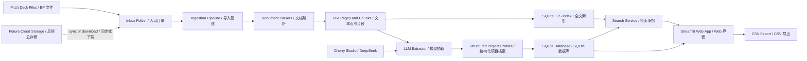

# BP Screener / BP 快速筛选工具

BP Screener is a lightweight deal-flow screening tool for student teams, angel communities, and small research groups that need to review large batches of pitch decks without building a full investment platform.

BP Screener 是一套轻量级 BP / 商业计划书筛选工具，适合学生团队、天使社群和小型研究小组，用较低成本快速处理大量项目材料，而不必搭建完整投研平台。

## About / 关于项目

The project turns raw business plans and pitch decks into a searchable, filterable project database. Users can upload or sync files into a local inbox, run a batch ingestion pipeline, and get structured profiles for each startup: industry, AI relevance, financing stage, business model, team highlights, traction, risks, recommendation level, tags, and evidence snippets.

本项目会把原始 BP 和 Pitch Deck 转换成可搜索、可筛选的结构化项目库。用户可以上传文件，或把云盘文件同步到本地入口目录，然后运行批处理流程，自动生成每个项目的结构化档案，包括行业、是否 AI 相关、融资阶段、商业模式、团队亮点、当前进展、风险、推荐等级、标签和证据片段。

It is intentionally low-cost and storage-agnostic. The current version uses local files, SQLite, SQLite FTS, Streamlit, and an OpenAI-compatible LLM endpoint such as Cherry Studio with DeepSeek. Cloud storage can be added later by syncing files into the inbox directory or pointing the ingestion pipeline at a mounted cloud-drive folder.

它的设计目标是低成本、低门槛，并且不绑定具体存储。当前版本使用本地文件、SQLite、SQLite FTS、Streamlit，以及 Cherry Studio / DeepSeek 等 OpenAI-compatible 模型接口。后续可以通过同步文件夹、云盘挂载或对象存储下载脚本接入飞书云盘、OneDrive、OSS、COS 等存储。

## Features / 功能

- Batch ingestion for `PDF / PPTX / DOCX / TXT / MD`
- 支持批量导入 `PDF / PPTX / DOCX / TXT / MD`
- LLM-powered structured extraction through Cherry Studio, DeepSeek, or any OpenAI-compatible endpoint
- 支持通过 Cherry Studio、DeepSeek 或其他 OpenAI-compatible 接口做结构化字段抽取
- Local SQLite project database
- 使用本地 SQLite 保存项目档案
- SQLite FTS keyword search over extracted document chunks
- 使用 SQLite FTS 对文档片段做关键词全文检索
- Streamlit web app for upload, ingestion, search, filtering, detail view, and CSV export
- 提供 Streamlit Web 界面，支持上传、处理、搜索、筛选、详情查看和 CSV 导出
- Evidence-first project profiles with source snippets when the model provides them
- 优先保留证据片段，便于回看模型判断依据
- Storage-agnostic design for Feishu Drive, OneDrive, OSS, COS, or local folders
- 存储层无绑定，可对接飞书云盘、OneDrive、OSS、COS 或本地文件夹

## Technical Architecture / 技术架构



## Repository Layout / 目录结构

```text
bp-screener/
  app.py                    # Streamlit web app / Web 界面
  bp_screener/
    config.py               # Runtime configuration / 运行配置
    db.py                   # SQLite schema and persistence helpers / 数据库结构与写入
    extractor.py            # LLM extraction and fallback heuristics / 模型抽取与兜底逻辑
    ingest.py               # Batch ingestion CLI / 批量导入命令
    parsers.py              # PDF, PPTX, DOCX, TXT, and MD parsing / 文档解析
    search.py               # Keyword search and structured filters / 检索与筛选
  data/
    inbox/                  # Local file inbox; replaceable with a synced cloud folder / 本地入口目录
```

## Setup / 安装

```powershell
cd path\to\bp-screener
python -m venv .venv
.\.venv\Scripts\Activate.ps1
pip install -r requirements.txt
copy .env.example .env
```

## Configure Cherry Studio / DeepSeek

## 配置 Cherry Studio / DeepSeek

Edit `.env`:

编辑 `.env`：

```env
LLM_BASE_URL=http://localhost:23333/v1
LLM_API_KEY=not-needed-for-local
LLM_MODEL=deepseek-chat
```

If Cherry Studio exposes a different OpenAI-compatible base URL, replace `LLM_BASE_URL` with the actual endpoint.

如果 Cherry Studio 暴露的 OpenAI-compatible 地址不同，请把 `LLM_BASE_URL` 改成实际地址。

If no model endpoint is available yet, uncheck "Use DeepSeek / Cherry Studio extraction" in the web app. The system will use a basic keyword-based fallback, which is useful for testing the workflow but not recommended for real screening.

如果暂时没有模型接口，可以在网页里取消勾选 “Use DeepSeek / Cherry Studio extraction / 使用 DeepSeek / Cherry Studio 抽取”。系统会使用简单关键词兜底，适合测试流程，不建议用于正式筛选。

## Run The Web App / 启动 Web 界面

```powershell
streamlit run app.py
```

Then:

1. Upload pitch decks from the sidebar, or copy files into `data/inbox/`. / 在侧边栏上传 BP，或直接把文件复制到 `data/inbox/`。
2. Click "Start / continue processing inbox". / 点击“Start / continue processing inbox / 开始或继续处理入口目录”。
3. Use "Project Library" for structured filters. / 在“Project Library / 项目库”里做结构化筛选。
4. Use "Search" for keyword search. / 在“Search / 检索”里做关键词搜索。
5. Use "Project Detail" to inspect one structured profile. / 在“Project Detail / 项目详情”里查看单个项目档案。

## Batch Ingestion / 命令行批量导入

```powershell
python -m bp_screener.ingest data\inbox --limit 100
```

Parse files without calling the model:

不调用模型，只测试解析流程：

```powershell
python -m bp_screener.ingest data\inbox --limit 10 --no-llm
```

## Storage Integration / 存储接入

The current entry point is `data/inbox/`. To add storage later, sync or download files into that directory, or change `BP_INBOX_DIR` in `.env`.

当前系统入口是 `data/inbox/`。后续接入云盘或对象存储时，只需要把文件同步或下载到这个目录，也可以在 `.env` 里修改 `BP_INBOX_DIR` 指向其他同步目录。

Recommended options:

- Feishu Drive: sync or download files into a local folder before ingestion. / 飞书云盘：先同步或下载到本地目录再导入。
- OneDrive: point `BP_INBOX_DIR` to the synced folder. / OneDrive：把 `BP_INBOX_DIR` 指向同步目录。
- OSS/COS: add a small downloader before `ingest.py`, or extend the ingestion layer to read object listings directly. / OSS/COS：在导入前加一个下载脚本，或扩展导入层直接读取对象列表。

## Current Limitations / 当前限制

- OCR is not wired in yet, so scanned PDFs may produce little or no text.
- 暂未接入 OCR，扫描版 PDF 可能无法提取到有效文本。
- Search is currently keyword-based with SQLite FTS; vector search can be added later.
- 当前检索基于 SQLite FTS 关键词搜索，后续可以增加向量语义检索。
- LLM quality depends on the model configured in Cherry Studio and its context length.
- 抽取质量取决于 Cherry Studio 中配置的模型能力和上下文长度。
- For 10,000 decks, use CLI batch ingestion instead of processing everything through the web UI at once.
- 如果要处理一万份 BP，建议使用命令行分批导入，不要一次性在网页里处理全部文件。

## Roadmap / 路线图

- Add OCR for scanned PDFs
- 增加扫描版 PDF 的 OCR
- Add vector search and semantic retrieval
- 增加向量搜索和语义检索
- Add project comparison views
- 增加项目对比视图
- Add source-page preview links
- 增加原文页预览链接
- Add Feishu Drive, OneDrive, OSS, or COS connectors
- 增加飞书云盘、OneDrive、OSS 或 COS 连接器

