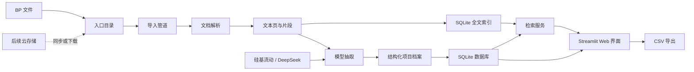

# BP 快速筛选工具

[English](README.md) | **中文**

BP Screener 是一套轻量级 BP / 商业计划书筛选工具，适合学生团队、天使社群和小型研究小组，用较低成本快速处理大量项目材料，而不必搭建完整投研平台。

## 关于项目

本项目会把原始 BP 和 Pitch Deck 转换成可搜索、可筛选的结构化项目库。用户可以上传文件，或把云盘文件同步到本地入口目录，然后运行批处理流程，自动生成每个项目的结构化档案，包括行业、是否 AI 相关、融资阶段、商业模式、团队亮点、当前进展、风险、推荐等级、标签和证据片段。

它的设计目标是低成本、低门槛，并且不绑定具体存储。当前版本使用本地文件、SQLite、SQLite FTS、Streamlit，以及硅基流动的 OpenAI-compatible DeepSeek 模型接口。后续可以通过同步文件夹、云盘挂载或对象存储下载脚本接入飞书云盘、OneDrive、OSS、COS 等存储。

## 功能

- 支持批量导入 `PDF / PPTX / DOCX / TXT / MD`
- 支持通过硅基流动、DeepSeek 或其他 OpenAI-compatible 接口做结构化字段抽取
- 使用本地 SQLite 保存项目档案
- 使用 SQLite FTS 对文档片段做关键词全文检索
- 提供 Streamlit Web 界面，支持上传、处理、搜索、筛选、详情查看和 CSV 导出
- 优先保留证据片段，便于回看模型判断依据
- 存储层无绑定，可对接飞书云盘、OneDrive、OSS、COS 或本地文件夹

## 技术架构



## 目录结构

```text
bp-screener/
  app.py                    # Web 界面
  bp_screener/
    config.py               # 运行配置
    db.py                   # 数据库结构与写入
    extractor.py            # 模型抽取与兜底逻辑
    ingest.py               # 批量导入命令
    parsers.py              # 文档解析
    search.py               # 检索与筛选
  data/
    inbox/                  # 本地入口目录，后续可替换为云盘同步目录
```

## 安装

```powershell
cd path\to\bp-screener
python -m venv .venv
.\.venv\Scripts\Activate.ps1
pip install -r requirements.txt
copy .env.example .env
```

## 配置 ModelBest / DeepSeek

编辑 `.env`：

```env
LLM_BASE_URL=https://llm-center.modelbest.cn/llm/v1
LLM_API_KEY=replace-with-your-local-api-key
LLM_MODEL=deepseek-v3.2
LLM_PROVIDER_ID=
LLM_ENABLE_THINKING=false
LLM_MAX_TOKENS=4096
LLM_TIMEOUT_SECONDS=120
```

系统会通过 ModelBest 的 OpenAI-compatible chat completion 接口调用模型。`LLM_PROVIDER_ID` 是可选项，需要指定渠道时再填写。

真实 API key 只放在本地 `.env`，不要提交到 Git。`.env` 已经在 `.gitignore` 中忽略。

如果暂时没有模型接口，可以在网页里取消勾选 “使用 DeepSeek V3.2 抽取”。系统会使用简单关键词兜底，适合测试流程，不建议用于正式筛选。

## 启动 Web 界面

```powershell
streamlit run app.py
```

然后：

1. 在侧边栏上传 BP，或直接把文件复制到 `data/inbox/`。
2. 点击“开始或继续处理入口目录”。
3. 在“项目库”里做结构化筛选。
4. 在“检索”里做关键词搜索。
5. 在“项目详情”里查看单个项目档案。

## 命令行批量导入

```powershell
python -m bp_screener.ingest data\inbox --limit 100
```

不调用模型，只测试解析流程：

```powershell
python -m bp_screener.ingest data\inbox --limit 10 --no-llm
```

## RAG / 语义检索

系统已内置轻量 RAG 检索层：

- `chunks_fts`：SQLite FTS 关键词全文检索
- `chunk_embeddings`：本地 feature-hashing 语义向量
- `Hybrid Search`：关键词 + 语义混合检索

新导入的 BP 会自动生成 chunk 向量。已有数据可以回填：

```powershell
python scripts\build_semantic_index.py
```

强制重建：

```powershell
python scripts\build_semantic_index.py --force
```

这一步参考 Open Notebook / NotebookLM 的思路，但保留 BP Screener 的垂直业务结构：项目档案、投资筛选字段、投委会评审、四人协作和 Notion 同步。

## 致谢

BP Screener 是面向学生小组 BP 筛选场景的垂直工作台，不是下面项目的 fork，但产品和架构设计参考了这些优秀项目：

- [AnythingLLM](https://github.com/mintplex-labs/anything-llm)：本地优先的 RAG workspace、文档处理 pipeline、多模型/多 provider 支持和 Agent 工作流。
- [Open Notebook](https://github.com/lfnovo/open-notebook)：NotebookLM 风格的 source 组织方式、基于资料的问答、引用和多资料知识库体验。
- [Atlas](https://atlas.org)：学生友好的任务入口、低门槛 AI 学习工作台和清晰的产品包装方式。

## 存储接入

当前系统入口是 `data/inbox/`。后续接入云盘或对象存储时，只需要把文件同步或下载到这个目录，也可以在 `.env` 里修改 `BP_INBOX_DIR` 指向其他同步目录。

推荐方式：

- 飞书云盘：先同步或下载到本地目录再导入。
- OneDrive：把 `BP_INBOX_DIR` 指向同步目录。
- OSS/COS：在导入前加一个下载脚本，或扩展导入层直接读取对象列表。

## Notion 协作工作台

Notion 适合作为四人小组的协作前台：项目库、筛选视图、人工评审、AI 投委会结论和操作日志。PDF 解析、LLM 抽取、全文检索仍由本地 BP Screener 负责，然后同步结构化结果到 Notion。

先在 Notion 创建一个空白父页面，并把这个页面分享给你的 Notion Internal Integration。然后在 `.env` 中配置：

```env
NOTION_API_KEY=secret_xxx
NOTION_PARENT_PAGE_ID=your-parent-page-id
```

创建 Notion 数据库：

```powershell
python scripts\notion_sync.py setup
```

同步本地 BP 数据：

```powershell
python scripts\notion_sync.py sync
```

测试前 10 条：

```powershell
python scripts\notion_sync.py sync --limit 10
```

脚本会创建并同步 4 个数据库：

- `BP Projects`：结构化项目库
- `BP Reviews`：四人小组人工评审
- `AI Committee Reviews`：AI 投委会评审
- `BP Activity Logs`：增删改操作日志

重复运行 `sync` 会更新同一条 Notion 页面，不会重复创建项目。

## Cloudflare 网页部署

仓库里已经加入 Cloudflare 版本的网页层：

- `web/`：用于 Cloudflare Pages 的静态前端
- `web/functions/api/`：Pages Functions API
- `web/_worker.js`：负责静态资源、API 和密码校验的 Pages Worker
- `cloudflare/schema.sql`：D1 数据表结构
- `scripts/sync_to_d1.py`：把本地 SQLite 结果导出成 D1 可导入 SQL
- `wrangler.toml`：Pages + D1 绑定配置模板

配置本地预览密码：

```powershell
copy .dev.vars.example .dev.vars
```

编辑 `.dev.vars`，设置共享访问密码：

```env
APP_PASSWORD=123456
```

不要提交 `.dev.vars`，它已经被 Git 忽略。

创建 D1 数据库：

```powershell
npx wrangler d1 create bp-screener
```

把返回的 `database_id` 填到 `wrangler.toml`，然后初始化数据库：

```powershell
npx wrangler d1 execute bp-screener --remote --file cloudflare/schema.sql
```

本地导入 BP 并生成 `data/bp_screener.sqlite` 后，导出 D1 数据：

```powershell
python scripts\sync_to_d1.py
npx wrangler d1 execute bp-screener --remote --file data\d1_seed.sql
```

部署 Pages 网站：

```powershell
npx wrangler pages deploy web --project-name bp-screener
```

创建 Cloudflare Pages 项目后，配置线上访问密码：

```powershell
npx wrangler pages secret put APP_PASSWORD --project-name bp-screener
```

如果缺少 `APP_PASSWORD`，API 请求会返回 `500`，不会默认公开项目数据。静态页面可以加载，但项目数据仍受保护。

你需要准备：

- Cloudflare 账号
- 通过 `npx wrangler login` 登录
- 一个 D1 database ID，并填入 `wrangler.toml`
- 一个网页共享访问密码
- 可选：在 Cloudflare Pages 里配置自定义域名

## 当前限制

- 暂未接入 OCR，扫描版 PDF 可能无法提取到有效文本。
- 当前检索基于 SQLite FTS 关键词搜索，后续可以增加向量语义检索。
- Cloudflare 网页端当前使用 D1 `LIKE` 做简单搜索；公开数据量变大后，可以升级为 D1 FTS 或专门的搜索服务。
- 抽取质量取决于硅基流动模型配置、模型能力和上下文长度。
- 如果要处理一万份 BP，建议使用命令行分批导入，不要一次性在网页里处理全部文件。

## 路线图

- 增加扫描版 PDF 的 OCR
- 增加向量搜索和语义检索
- 增加项目对比视图
- 增加原文页预览链接
- 增加飞书云盘、OneDrive、OSS 或 COS 连接器
