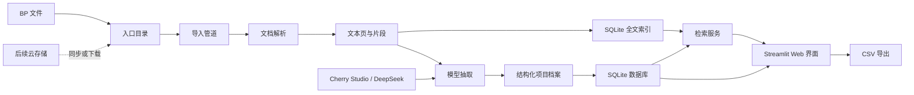

# BP 快速筛选工具

[English](README.md) | **中文**

BP Screener 是一套轻量级 BP / 商业计划书筛选工具，适合学生团队、天使社群和小型研究小组，用较低成本快速处理大量项目材料，而不必搭建完整投研平台。

## 关于项目

本项目会把原始 BP 和 Pitch Deck 转换成可搜索、可筛选的结构化项目库。用户可以上传文件，或把云盘文件同步到本地入口目录，然后运行批处理流程，自动生成每个项目的结构化档案，包括行业、是否 AI 相关、融资阶段、商业模式、团队亮点、当前进展、风险、推荐等级、标签和证据片段。

它的设计目标是低成本、低门槛，并且不绑定具体存储。当前版本使用本地文件、SQLite、SQLite FTS、Streamlit，以及 Cherry Studio / DeepSeek 等 OpenAI-compatible 模型接口。后续可以通过同步文件夹、云盘挂载或对象存储下载脚本接入飞书云盘、OneDrive、OSS、COS 等存储。

## 功能

- 支持批量导入 `PDF / PPTX / DOCX / TXT / MD`
- 支持通过 Cherry Studio、DeepSeek 或其他 OpenAI-compatible 接口做结构化字段抽取
- 使用本地 SQLite 保存项目档案
- 使用 SQLite FTS 对文档片段做关键词全文检索
- 提供 Streamlit Web 界面，支持上传、处理、搜索、筛选、详情查看和 CSV 导出
- 优先保留证据片段，便于回看模型判断依据
- 存储层无绑定，可对接飞书云盘、OneDrive、OSS、COS 或本地文件夹

## 技术架构



## 目录结构

```text
bp-screener/
  app.py                    # Web 界面
  bp_screener/
    config.py               # 运行配置
    db.py                   # 数据库结构与写入
    extractor.py            # 模型抽取与兜底逻辑
    ingest.py               # 批量导入命令
    parsers.py              # 文档解析
    search.py               # 检索与筛选
  data/
    inbox/                  # 本地入口目录，后续可替换为云盘同步目录
```

## 安装

```powershell
cd path\to\bp-screener
python -m venv .venv
.\.venv\Scripts\Activate.ps1
pip install -r requirements.txt
copy .env.example .env
```

## 配置 Cherry Studio / DeepSeek

编辑 `.env`：

```env
LLM_BASE_URL=http://localhost:23333/v1
LLM_API_KEY=not-needed-for-local
LLM_MODEL=deepseek-chat
```

如果 Cherry Studio 暴露的 OpenAI-compatible 地址不同，请把 `LLM_BASE_URL` 改成实际地址。

如果暂时没有模型接口，可以在网页里取消勾选 “使用 DeepSeek / Cherry Studio 抽取”。系统会使用简单关键词兜底，适合测试流程，不建议用于正式筛选。

## 启动 Web 界面

```powershell
streamlit run app.py
```

然后：

1. 在侧边栏上传 BP，或直接把文件复制到 `data/inbox/`。
2. 点击“开始或继续处理入口目录”。
3. 在“项目库”里做结构化筛选。
4. 在“检索”里做关键词搜索。
5. 在“项目详情”里查看单个项目档案。

## 命令行批量导入

```powershell
python -m bp_screener.ingest data\inbox --limit 100
```

不调用模型，只测试解析流程：

```powershell
python -m bp_screener.ingest data\inbox --limit 10 --no-llm
```

## 存储接入

当前系统入口是 `data/inbox/`。后续接入云盘或对象存储时，只需要把文件同步或下载到这个目录，也可以在 `.env` 里修改 `BP_INBOX_DIR` 指向其他同步目录。

推荐方式：

- 飞书云盘：先同步或下载到本地目录再导入。
- OneDrive：把 `BP_INBOX_DIR` 指向同步目录。
- OSS/COS：在导入前加一个下载脚本，或扩展导入层直接读取对象列表。

## 当前限制

- 暂未接入 OCR，扫描版 PDF 可能无法提取到有效文本。
- 当前检索基于 SQLite FTS 关键词搜索，后续可以增加向量语义检索。
- 抽取质量取决于 Cherry Studio 中配置的模型能力和上下文长度。
- 如果要处理一万份 BP，建议使用命令行分批导入，不要一次性在网页里处理全部文件。

## 路线图

- 增加扫描版 PDF 的 OCR
- 增加向量搜索和语义检索
- 增加项目对比视图
- 增加原文页预览链接
- 增加飞书云盘、OneDrive、OSS 或 COS 连接器
