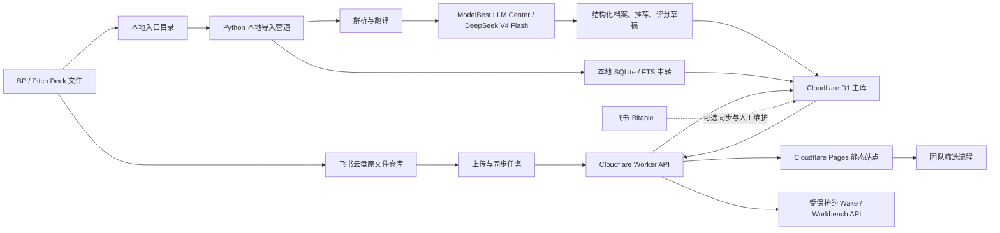

# VRT BP Screener

[English](README.md) | **中文**

VRT BP Screener 是一套轻量级 BP / 商业计划书筛选工具，适合学生团队、天使社群和小型研究小组，用较低成本快速处理大量项目材料，而不必搭建完整投研平台。

## 关于项目

本项目会把原始 BP 和 Pitch Deck 转换成可搜索、可筛选的结构化项目库。用户可以上传文件，或把云盘文件同步到本地入口目录，然后运行批处理流程，自动生成每个项目的结构化档案，包括行业、是否 AI 相关、融资阶段、商业模式、团队亮点、当前进展、风险、推荐等级、标签和证据片段。

它的设计目标是低成本、低门槛，服务 5 人小团队。线上版本使用 Cloudflare Pages、Pages Worker、D1 主数据库，并把飞书云盘作为 BP 原文件仓库；Python/Streamlit 路径主要保留给本地导入和遗留开发。

## 功能

- 支持批量导入 `PDF / PPTX / DOCX / TXT / MD`
- 使用 PyMuPDF 做快速 PDF 文本抽取，并可配置 `pypdf` 兜底
- 支持对扫描版 PDF 做可选本地 OCR 兜底
- 支持通过 ModelBest LLM Center / DeepSeek 或其他 OpenAI-compatible 接口做结构化字段抽取
- 线上应用使用 Cloudflare D1 保存项目档案和团队协作状态
- 本地 SQLite 用于导入、开发和导出中转
- 使用 SQLite FTS 对文档片段做关键词全文检索
- 提供 Cloudflare Web 工作台，支持上传、处理、搜索、筛选、详情查看和团队评审
- 项目库支持类似电商列表的多条件筛选和排序：国家/地区、客户类型、收入阶段、风险等级、综合筛选分、团队分、进展分等
- 优先保留证据片段，便于回看模型判断依据
- 存储层无绑定，可对接飞书云盘、OneDrive、OSS、COS 或本地文件夹

## 技术架构


```mermaid
flowchart LR
    A[BP / Pitch Deck 文件] --> B[飞书云盘原文件仓库]
    A --> C[本地入口目录]
    B --> D[上传与同步任务]
    C --> E[Python 本地导入管道]
    E --> F[解析与翻译]
    D --> I[Cloudflare Worker API]
    F --> G[ModelBest LLM Center / DeepSeek V4 Flash]
    G --> H[结构化档案、推荐、评分草稿]
    H --> J[Cloudflare D1 主库]
    E --> K[本地 SQLite / FTS 中转]
    K --> J
    I --> J
    J --> I
    I --> L[Cloudflare Pages 静态站点]
    L --> M[团队筛选流程]
    I --> N[受保护的 Wake / Workbench API]

    O[飞书 Bitable] -. 可选同步与人工维护 .-> J
```

线上生产前端是 Cloudflare Pages 静态站点，主要文件在 `web/index.html`、`web/app.js`、`web/styles.css`。后端 API 是 Cloudflare Worker，入口为 `web/_worker.js`，负责项目列表、筛选、推荐、评分草稿、协作、上传、wake 和 workbench 等接口。

Cloudflare D1 是线上系统主数据源，保存项目档案、双语 profile、评分、评论、提名、浏览记录、BP 标记、基于 session 的协作记录和上传 ingest 任务。飞书主要作为 BP 原文件仓库；Bitable 可以辅助同步或人工维护，但结构化筛选数据和协作状态以 D1 为主。

`bp_screener/` 和 `scripts/` 里的 Python 代码负责本地抽取、解析、翻译、飞书同步、D1 导出和运维同步任务。`app.py` 仍可作为本地/遗留 Streamlit workbench 使用，但不是生产主 UI。

LLM 通过 ModelBest LLM Center / DeepSeek V4 Flash 提供抽取、双语 profile、推荐、评分草稿和总结能力；最终评分和筛选结论由团队成员人工确认。

当前线上运行行为：

- 上传请求由 Worker 进入飞书云盘，然后在 D1 写入 `documents(status='uploaded')` 和 `ingest_jobs(status='queued')`，作为交给本地 Python 导入 operator 的持久交接点。
- `scripts/process_ingest_jobs.py` 可以恢复超时停在 `processing` 的任务，也可以为缺失 job 的 uploaded 文档做对账；默认只 dry-run，只有传 `--apply` 才会修改 D1。
- `STRICT_SCHEMA=true` 面向已完成迁移的环境：Worker 会先检查过渡期列是否已经存在，只有缺失列需要运行期 `ALTER TABLE` 时才会阻止请求。
- 项目列表的 `hideDiscussed=true`、`hideNotInterested=true` 等可见性筛选已在 Worker 侧、`LIMIT` 前处理；前端保留客户端筛选作为二次兜底。

AI 分析简报 v1 是项目详情里的可选功能。评审者每次只对一个 BP 手动点击生成；Worker 读取现有 D1 项目字段和原文 chunk，调用配置好的 ModelBest 兼容 LLM 产出有证据约束的 JSON，并把版本化简报存入 `bp_ai_analysis_artifacts`。它不会批量自动生成，不替代 VRT Ask，也不替代人工评分或尽调判断。

## 目录结构

```text
bp-screener/
  app.py                    # 遗留/本地 Streamlit 界面
  web/                      # Cloudflare Pages 前端和 Worker
  cloudflare/schema.sql     # 会清空表的空库 D1 基线，不是生产迁移
  bp_screener/
    config.py               # 运行配置
    db.py                   # 数据库结构与写入
    extractor.py            # 模型抽取与兜底逻辑
    ingest.py               # 批量导入命令
    parsers.py              # 文档解析
    search.py               # 检索与筛选
  data/
    inbox/                  # 本地导入入口；不要提交生成数据
```

## 安装

```powershell
cd path\to\bp-screener
python -m venv .venv
.\.venv\Scripts\Activate.ps1
pip install -r requirements.txt
copy .env.example .env
```

## 配置 ModelBest / DeepSeek

编辑 `.env`：

```env
LLM_BASE_URL=https://llm-center.modelbest.cn/llm/v1
LLM_API_KEY=replace-with-your-local-api-key
LLM_MODEL=deepseek-v4-flash
LLM_PROVIDER_ID=
LLM_ENABLE_THINKING=false
LLM_MAX_TOKENS=4096
LLM_TIMEOUT_SECONDS=120
```

系统会通过 ModelBest 的 OpenAI-compatible chat completion 接口调用模型。`LLM_PROVIDER_ID` 是可选项，需要指定渠道时再填写。

真实 API key 只放在本地 `.env`，不要提交到 Git。`.env` 已经在 `.gitignore` 中忽略。

如果暂时没有模型接口，可以在网页里取消勾选 “使用 LLM 抽取”。系统会使用简单关键词兜底，适合测试流程，不建议用于正式筛选。

## 可选本地 OCR

扫描版或图片版 PDF 可能没有可复制文本。BP Screener 可以在调用 LLM 抽取前先做本地 OCR，把这些 BP 转成可搜索、可问答、可结构化分析的文本。

先安装 Python 依赖：

```powershell
pip install -r requirements.txt
```

再单独安装 Tesseract OCR 桌面引擎。如果没有加入 `PATH`，在 `.env` 里指定路径：

```env
PDF_TEXT_ENGINE=pymupdf
OCR_ENABLED=true
OCR_LANG=eng+chi_sim
OCR_MIN_PAGE_CHARS=80
OCR_MIN_DOCUMENT_CHARS=800
OCR_MAX_PAGES=25
OCR_DPI=180
TESSERACT_CMD=C:\Program Files\Tesseract-OCR\tesseract.exe
OCR_TESSDATA_DIR=data/tessdata
```

`PDF_TEXT_ENGINE=pymupdf` 会优先使用更快的本地 PyMuPDF 解析器；如果想保留 `pypdf` 兜底，可以设为 `PDF_TEXT_ENGINE=auto`。OCR 只会在整份 PDF 原生文本都很少时触发，避免普通可复制文本的 BP 因为个别图片页而被拖慢。`OCR_MAX_PAGES` 用来限制每份 BP 最多 OCR 的页数。

## 启动 Web 界面

```powershell
streamlit run app.py
```

然后：

1. 在侧边栏上传 BP，或直接把文件复制到 `data/inbox/`。
2. 点击“开始或继续处理入口目录”。
3. 在“项目库”里做结构化筛选。
4. 在“检索”里做关键词搜索。
5. 在“项目详情”里查看单个项目档案。

## 命令行批量导入

```powershell
python -m bp_screener.ingest data\inbox --limit 100
```

不调用模型，只测试解析流程：

```powershell
python -m bp_screener.ingest data\inbox --limit 10 --no-llm
```

## RAG / 语义检索

系统已内置轻量 RAG 检索层：

- `chunks_fts`：SQLite FTS 关键词全文检索
- `chunk_embeddings`：本地 feature-hashing 语义向量
- `Hybrid Search`：关键词 + 语义混合检索
- `Ask All BPs` 缓存：资料库没有变化时，重复问题会直接复用本地 SQLite 问答缓存

这部分参考了 RAGFlow、LlamaIndex、Milvus、mem0、LightRAG 和 llmware 的共同思路：先用便宜的本地信号缩小候选集，再把计算花在更少、更相关的内容上。为了保持学生小组版本轻量，当前默认不引入独立向量数据库：

- 先用 BM25 / FTS 快速召回候选。
- 再用结构化项目档案补充高信号元数据。
- 本地向量优先只在候选集内重排。
- 如果没有候选，语义检索最多扫描 `RAG_SEMANTIC_MAX_ROWS` 条 chunk。
- 全库问答会缓存结果，直到 BP 资料库发生更新。

可以在 `.env` 调整速度参数：

```env
RAG_KEYWORD_PREFILTER_LIMIT=80
RAG_SEMANTIC_MAX_ROWS=20000
RAG_QA_CACHE_ENABLED=true
```

新导入的 BP 会自动生成 chunk 向量。已有数据可以回填：

```powershell
python scripts\build_semantic_index.py
```

强制重建：

```powershell
python scripts\build_semantic_index.py --force
```

这一步参考 Open Notebook / NotebookLM 的思路，但保留 BP Screener 的垂直业务结构：项目档案、投资筛选字段、投委会评审、团队协作和 Notion 同步。

## 致谢

BP Screener 是面向学生小组 BP 筛选场景的垂直工作台，不是下面项目的 fork，但产品和架构设计参考了这些优秀项目：

- [AnythingLLM](https://github.com/mintplex-labs/anything-llm)：本地优先的 RAG workspace、文档处理 pipeline、多模型/多 provider 支持和 Agent 工作流。
- [Open Notebook](https://github.com/lfnovo/open-notebook)：NotebookLM 风格的 source 组织方式、基于资料的问答、引用和多资料知识库体验。
- [Atlas](https://atlas.org)：学生友好的任务入口、低门槛 AI 学习工作台和清晰的产品包装方式。

## 存储接入

当前系统入口是 `data/inbox/`。后续接入云盘或对象存储时，只需要把文件同步或下载到这个目录，也可以在 `.env` 里修改 `BP_INBOX_DIR` 指向其他同步目录。

本机这批 BP 可以直接指向：

```env
BP_INBOX_DIR=C:\Users\zfyar\.cursor\projects\BPs
```

推荐方式：

- 飞书云盘：先同步或下载到本地目录再导入。
- OneDrive：把 `BP_INBOX_DIR` 指向同步目录。
- OSS/COS：在导入前加一个下载脚本，或扩展导入层直接读取对象列表。

## Notion 协作工作台

Notion 适合作为团队协作前台：项目库、筛选视图、人工评审、AI 投委会结论和操作日志。PDF 解析、LLM 抽取、全文检索仍由本地 BP Screener 负责，然后同步结构化结果到 Notion。

先在 Notion 创建一个空白父页面，并把这个页面分享给你的 Notion Internal Integration。然后在 `.env` 中配置：

```env
NOTION_API_KEY=secret_xxx
NOTION_PARENT_PAGE_ID=your-parent-page-id
```

创建 Notion 数据库：

```powershell
python scripts\notion_sync.py setup
```

同步本地 BP 数据：

```powershell
python scripts\notion_sync.py sync
```

测试前 10 条：

```powershell
python scripts\notion_sync.py sync --limit 10
```

脚本会创建并同步 4 个数据库：

- `BP Projects`：结构化项目库
- `BP Reviews`：团队人工评审
- `AI Committee Reviews`：AI 投委会评审
- `BP Activity Logs`：增删改操作日志

重复运行 `sync` 会更新同一条 Notion 页面，不会重复创建项目。

## Cloudflare 网页部署

仓库里已经包含 VRT BP Screener 的生产 Cloudflare 网页层：

- `web/index.html`、`web/app.js`、`web/styles.css`：Cloudflare Pages 静态前端
- `web/_worker.js`：Worker API，负责项目数据、筛选、推荐、评分草稿、协作、上传、wake、workbench、会话鉴权和静态资源
- `cloudflare/schema.sql`：会清空表的空库 D1 基线；不要当作生产迁移执行
- `scripts/sync_to_d1.py`：把本地管道结果导出成 D1 可导入 SQL
- `wrangler.toml`：Pages + D1 绑定配置模板
- `docs/architecture-runbook.md`：生产数据和运维边界说明

配置本地预览凭据：

```powershell
copy .dev.vars.example .dev.vars
```

编辑 `.dev.vars`，设置本地 session secret：

```env
BP_SESSION_SECRET=replace-with-a-long-random-session-secret
```

不要提交 `.dev.vars`，它已经被 Git 忽略。

创建 D1 数据库：

```powershell
npx wrangler d1 create bp-screener
```

把返回的 `database_id` 填到 `wrangler.toml`，然后初始化数据库：

```powershell
npx wrangler d1 execute bp-screener --remote --file cloudflare/schema.sql
```

`cloudflare/schema.sql` 开头包含 `DROP TABLE IF EXISTS`，只适合全新空库或可丢弃环境。生产库或已有数据的 D1 不要重放这个基线，应只执行尚未应用的非破坏性 `cloudflare/migrate_*.sql` 文件。

本地导入 BP 并生成 `data/bp_screener.sqlite` 后，导出 D1 数据 upsert：

```powershell
python scripts\sync_to_d1.py
npx wrangler d1 execute bp-screener --remote --file data\d1_seed.sql
```

线上上传会写入 `documents(status='uploaded')` 并创建对应 `ingest_jobs(status='queued')`。如果本地 worker 或脚本在 `processing` 状态中断，`claim` 和 `process-one` 默认会先按 `INGEST_STALE_PROCESSING_MINUTES` / `--stale-minutes` 对超时任务做 dry-run 恢复，再继续 claim。也可以显式运行：

```powershell
.\.venv\Scripts\python.exe scripts\process_ingest_jobs.py recover-stale --stale-minutes 60
.\.venv\Scripts\python.exe scripts\process_ingest_jobs.py recover-stale --stale-minutes 60 --apply
.\.venv\Scripts\python.exe scripts\process_ingest_jobs.py reconcile-uploads
.\.venv\Scripts\python.exe scripts\process_ingest_jobs.py reconcile-uploads --apply
```

`reconcile-uploads` 只会为没有 job 的 `documents(status='uploaded')` 新增缺失的 `ingest_jobs`，不会删除文档，也不会重置已有 job。

D1 是线上系统的主库。`scripts/sync_to_d1.py` 默认不会执行 destructive reset；生产 DROP/reset 必须有明确授权。完整 schema reset 现在必须同时传 `--reset-schema` 和 `--allow-drop`，只应在临时环境或明确批准时使用：

```powershell
python scripts\sync_to_d1.py --reset-schema --allow-drop --execute
```

部署 Pages 网站：

```powershell
npx wrangler pages deploy web --project-name bp-screener
```

创建 Cloudflare Pages 项目后，配置线上 session secret：

```powershell
npx wrangler pages secret put BP_SESSION_SECRET --project-name bp-screener
```

登录采用 5 个固定团队成员加 Worker session token 的极简方案。生产环境必须配置强 `BP_SESSION_SECRET`，否则 session 创建会返回配置错误，不会静默使用弱默认值。`DEBUG_ERRORS=true` 只建议本地调试时开启，用于返回 500 detail；`STRICT_SCHEMA=true` 可在 D1 迁移稳定后阻止运行期 `ALTER TABLE`。

推送 web / ingest 相关改动前，可以先运行这些 CI 风格的本地检查：

```powershell
node --check web\_worker.js
python -m py_compile scripts\process_ingest_jobs.py
python -m pytest tests\test_process_ingest_jobs.py
```

你需要准备：

- Cloudflare 账号
- 通过 `npx wrangler login` 登录
- 一个 D1 database ID，并填入 `wrangler.toml`
- 一个强 `BP_SESSION_SECRET` Pages secret
- 可选：在 Cloudflare Pages 里配置自定义域名

## 当前限制

- 暂未接入 OCR，扫描版 PDF 可能无法提取到有效文本。
- 当前检索基于 SQLite FTS 关键词搜索，后续可以增加向量语义检索。
- Cloudflare 网页端当前使用 D1 `LIKE` 做简单搜索；公开数据量变大后，可以升级为 D1 FTS 或专门的搜索服务。
- 抽取质量取决于硅基流动模型配置、模型能力和上下文长度。
- 如果要处理一万份 BP，建议使用命令行分批导入，不要一次性在网页里处理全部文件。

## 路线图

- 随着线上 API 增长，把 Worker 拆成更清晰的模块
- 将批量 LLM 抽取、推荐和总结任务队列化
- 增加评分、协作、session 和管理操作的 audit log
- 为线上 D1 项目库增加语义搜索能力
- 持续完善飞书同步和可选 Bitable 人工维护流程
